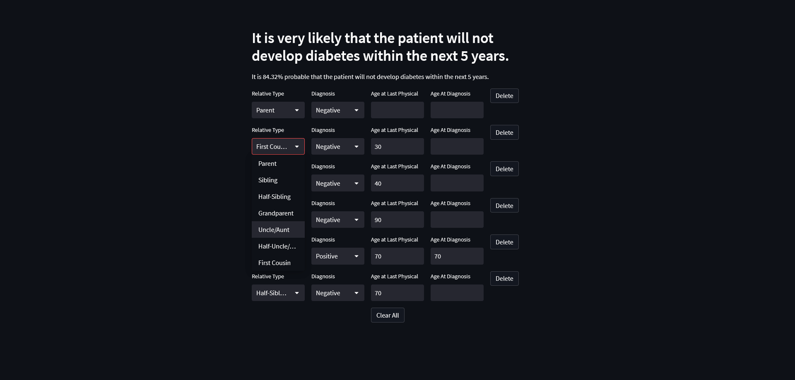

# Diabetes Diagnosis
A Web Application that Uses Gradient-Boosted Machine Learning to Accurately Predict the Onset of Diabetes 

## Local Install
Start by cloning this project.

``$ git clone https://github.com/krishkankure/diabetes-diagnosis.git``

Now navigate to `src/`

To install the dependencies required for this app, run

``$ pip install -r requirements.txt``

Lastly, to run this project,

``$ streamlit run stream.py``

By default, streamlit will run on port 8501, so navigate to localhost:8501
## Docker

To create a docker image and run it in a container,

```
$ docker build -t diabetes:latest .
$ docker run -p 8501:8501 diabetes:latest
```
The app will be running on localhost:8501